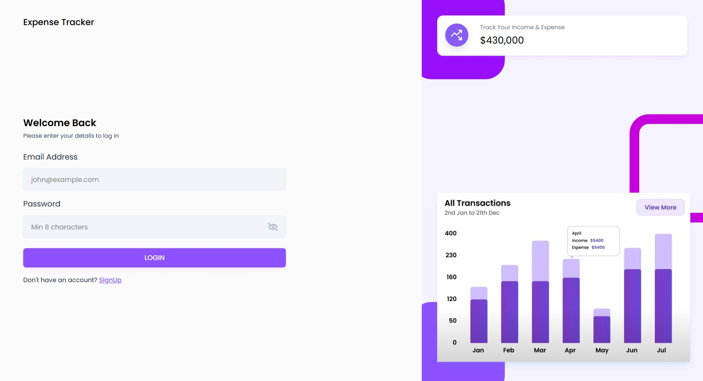
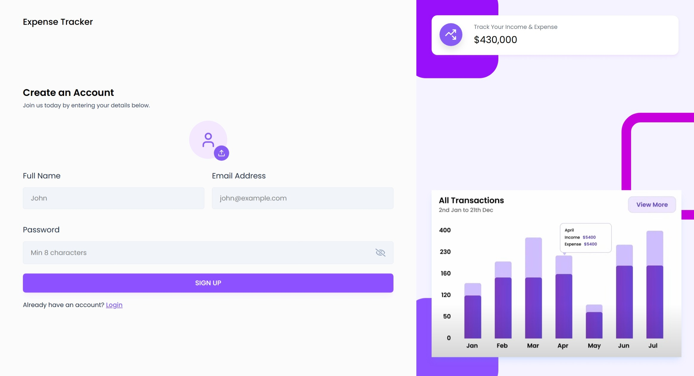
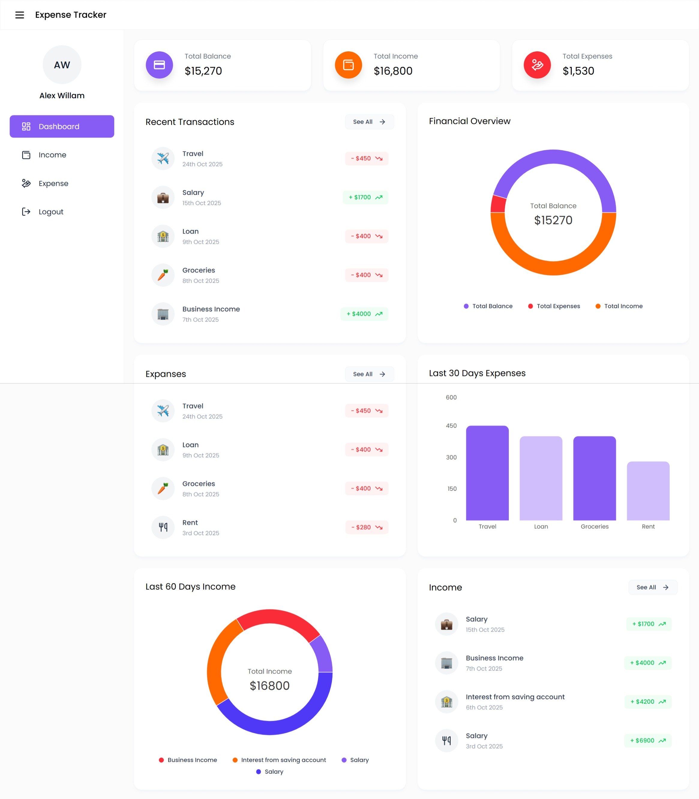
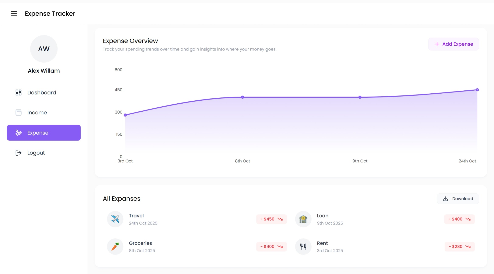
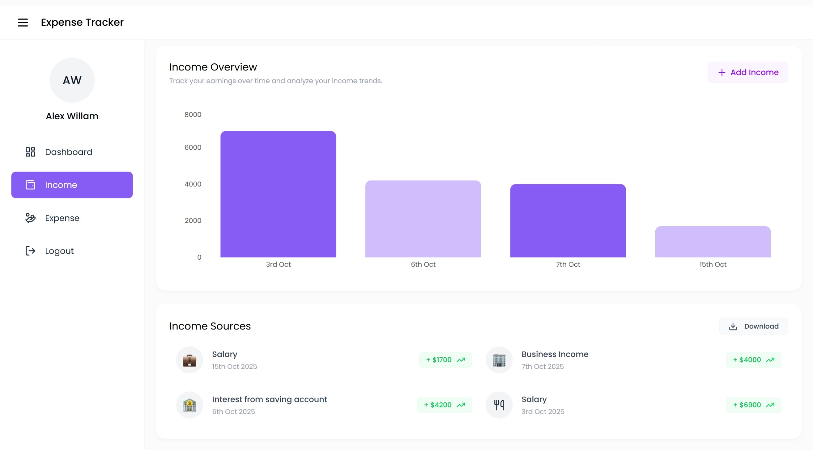

# 💰 Expense Tracker

A modern and intuitive **Expense Tracker** web application that helps you manage your finances by tracking **income** and **expenses**, and visualizing your financial trends.

---

## 🚀 Features

- 📊 **Dashboard Overview** – Get a summary of total income, expenses, and balance.
- 💵 **Income Management** – Add, view, and analyze your income sources.
- 💸 **Expense Management** – Track your spending with category insights.
- 📈 **Financial Analytics** – Visual charts for income and expense trends.
- 👤 **User Authentication** – Secure login and signup system.
- ⬇️ **Download Reports** – Export your data easily.

---

## 🖼️ Screenshots

### 🔐 Login Page


### 📝 Signup Page


### 🏠 Dashboard


### 💸 Expense Page


### 💵 Income Page


---

## 🧩 Tech Stack

- **Frontend:** React.js  
- **Styling:** Tailwind CSS or Styled Components  
- **Backend:** Node.js / Express.js  
- **Database:** MongoDB   
- **Authentication:** JWT 
- **Charts:** Chart.js / Recharts  

---

## ⚙️ Installation & Setup

1. **Clone the repository**
   ```bash
   git clone https://github.com/AnasKhan322/Expense-Tracker.git
   cd expense-tracker


2. **Backend Setup**
   ```bash
   cd backend
   npm install
   npm run dev

3.**Frontend Setup**
   ```bash
   cd ../frontend/expense-tracker
   npm install
   npm run dev

4.**Set up environment variables**
   ```bash
   MONGO_URI=your_database_url
   JWT_SECRET=your_secret_key
   PORT=8000


